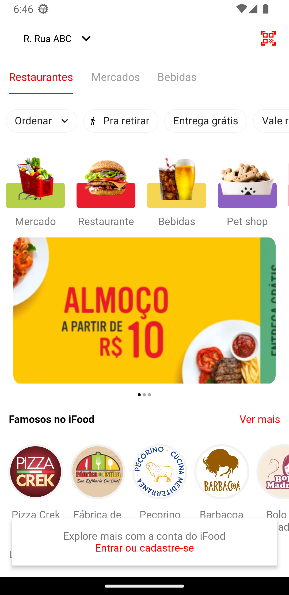
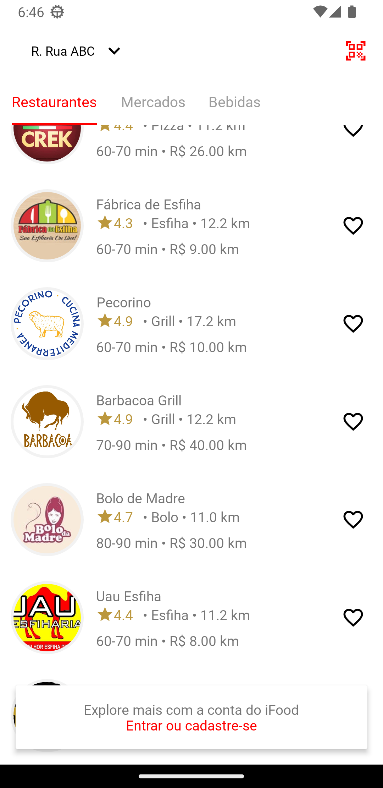

<h1 align="center">
    Ifood Clone Nativo
</h1>
 

Clone do ifood usando Kotlin

Telas do App

    
    

## :rocket: Tecnologias

Esse projeto foi desenvolvido com as seguintes tecnologias:

- [Kotlin]

## 🤔 Como contribuir

- Faça um fork desse repositório;
- Cria uma branch com a sua feature: `git checkout -b minha-feature`;
- Faça commit das suas alterações: `git commit -m 'feat: Minha nova feature'`;
- Faça push para a sua branch: `git push origin minha-feature`.

Depois que o merge da sua pull request for feito, você pode deletar a sua branch.
